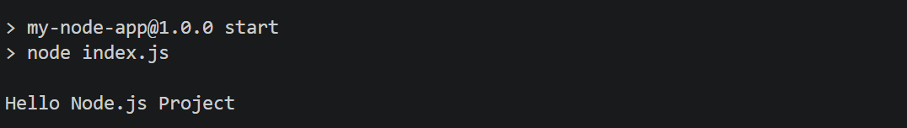
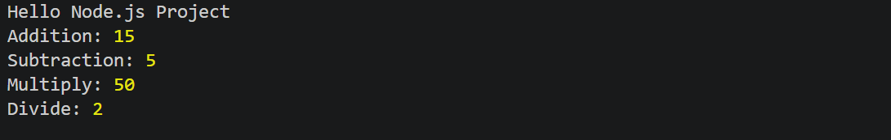
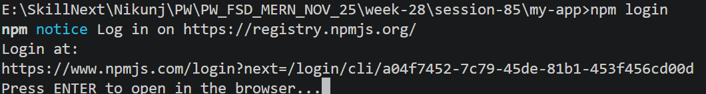
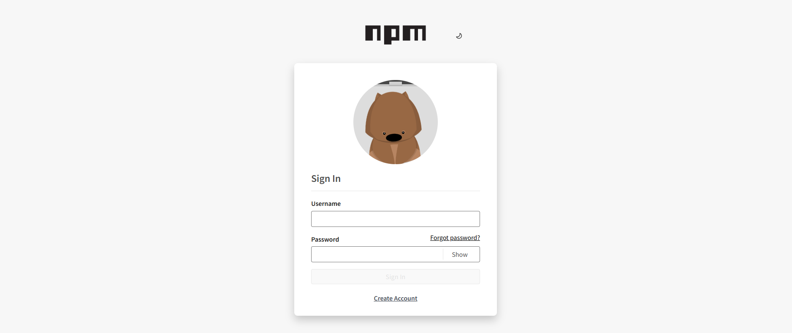

# Node js 
[Download](https://nodejs.org/en/download)

## Step:1 Create a Project Folder
```
mkdir my-node-app
```

## Step:2 Move into Project Folder
```
cd my-node-app
```
## Step:3 Initialize Node.js Project
```
npm init
```
- Node.js will ask Questions
```
package name: (my-node-app)
version: (1.0.0)
description:
entry point: (index.js)
author:
license: (ISC)
```
- it will create package.json file
```
{
  "name": "my-node-app",
  "version": "1.0.0",
  "description": "my first nodejs project",
  "keywords": [
    "node",
    "js",
    "project"
  ],
  "license": "ISC",
  "author": "Nikunj Soni",
  "type": "commonjs",
  "main": "index.js",
  "scripts": {
    "test": "echo \"Error: no test specified\" && exit 1"
  }
}

```

OR

## Shortcut Method
```
npm init -y
```
- it will create basic package.json file which you can edit as per your requirenment
```
{
  "name": "my-node-app",
  "version": "1.0.0",
  "description": "",
  "main": "index.js",
  "scripts": {
    "test": "echo \"Error: no test specified\" && exit 1"
  },
  "keywords": [],
  "author": "",
  "license": "ISC",
  "type": "commonjs"
}

```
## Step:4 Create First Script
- index.js
```
console.log("Hello Node.js Project");
```
- Now edit the package.json file
```
 "scripts": {
    "start":"node index.js",
  },
``` 
- instead of running "node index.js" we will use
```
npm start
```
- Output: 



# Modularize Application using "commonjs"
- goto> package.json file
```
"type": "commonjs"
```
- create 'calculator.js' file
```
function add(a,b){
    return a + b;
}

function sub(a,b){
    return a - b;
}
function multiply(a,b){
    return a * b;
}

function divide(a,b){
    if(b==0){
        return "na"
    } 
    return a / b;
}

module.exports = {add,sub,multiply,divide}
```
- here module.export help to use this file in another file (as it now work as modularize app)
- index.js
```

const calc= require("./calculator")
 
console.log("Addition:",calc.add(10,5))
console.log("Subtraction:",calc.sub(10,5))
console.log("Multiply:",calc.multiply(10,5))
console.log("Divide:",calc.divide(10,5))
```
- Run the project
```
npm start
```
- OUTPUT:



# Modularize Application using "module"
- goto> package.json file
```
"type": "module"
```
- create 'calculator.js' file
```
function add(a,b){
    return a + b;
}

function sub(a,b){
    return a - b;
}
function multiply(a,b){
    return a * b;
}

function divide(a,b){
    if(b==0){
        return "na"
    } 
    return a / b;
}

const calculator={
    add,sub,multiply,divide
};

export default calculator;
```
- here module.export help to use this file in another file (as it now work as modularize app)
- index.js
```

import calculator from "./calculator.js"
 
console.log("Addition:",calc.add(10,5))
console.log("Subtraction:",calc.sub(10,5))
console.log("Multiply:",calc.multiply(10,5))
console.log("Divide:",calc.divide(10,5))
```
- Run the project
```
npm start
```
- OUTPUT:


- Conclusion
- Here 
```
const calc= require("./calculator")
```
- is replaced by
```
import calculator from "./calculator.js"
```
# Install Packages in Node js
- Node js has various libraries(Packages) avaialble that you can easily download using node package manages using 'npm'
```
npm install express
```
or Shortcut
```
npm i express
```
- open package.json file and you will see
```
"dependencies": {
    "express": "^5.2.1"
  }
```
## Note
- Here 5-> Major Version (Big Changes)
- Here 2-> Minor Version (New Feature)
- Here 1-> Patch Version (Bug Fixes)
- ^ Install Compatible updated Automatically
## Update package
```
npm update express
```
## Uninstall package
```
npm uninstall express
```

## npm login
```
npm login
```





## Publish Package
```
npm publish
```
--------------------------------------------------------------------------------
# fs Module
- the fs (File System) module allows Node.js to:
1. Create Files
2. Read File
3. Upload Files
4. Delete Files
5. Create Folders
6. Delete Folders
- since 'fs' is a built in module (No need to download using npm)
```
import fs from "fs";
```
## 1. Synchronous File Operations
- Synchronus means :
```
Do Task 1
Wait
Complete Task 1
Then Do Task 2
```
## Create File
```
import fs from "fs";

fs.writeFileSync("student.txt", "Hello Students");

console.log("File Created");
```
- it eill create a new file in the same folder 'student.txt'

## Read a File
```
import fs from "fs";

const data = fs.readFileSync("student.txt", "utf8");

console.log(data);
```
## Append Data
```
import fs from "fs";

fs.appendFileSync("student.txt", "\nWelcome to Node.js");
```

## Delete File
```
import fs from "fs";

fs.unlinkSync("student.txt");
```

## 2. Asynchronous File Operations
- Asynchronus Means:
```
Start Task
Don't Wait
Continue Other Work
Execute Callback When Done
```
## Create File
```
import fs from 'fs';

fs.writeFile("student.txt","Hello Students!",(err)=>{
    if(err){
        console.log(err);
        return;
    }
    console.log("File Created!")
});
 
```
- Similarly You Can create the rest all Operations
## Read File
```
import fs from 'fs';

fs.readFile("student.txt","utf-8",(err,data)=>{
    if(err){
        console.log(err);
        return;
    }
    console.log("Data in file: ",data);
});

```

## Update File
```
Write Code By Your Own
```

## Delete File
```
Write Code By Your Own
```