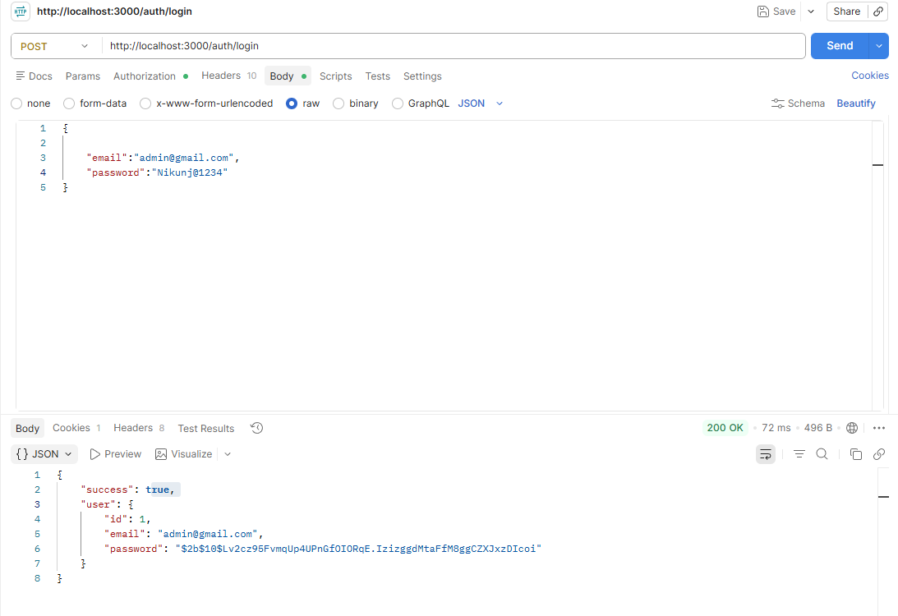
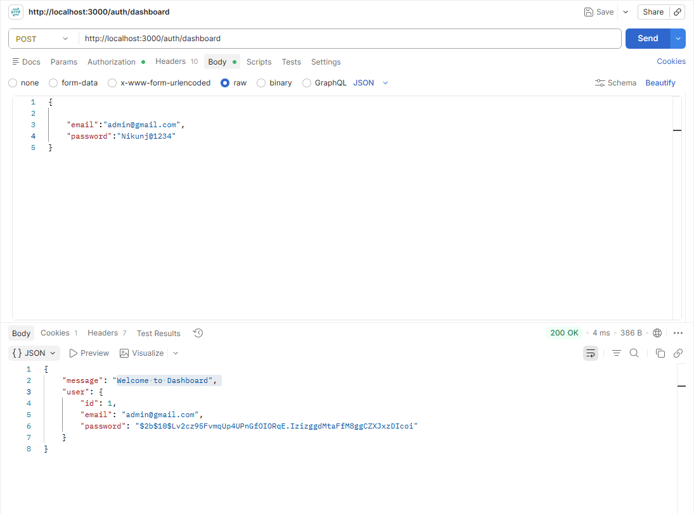
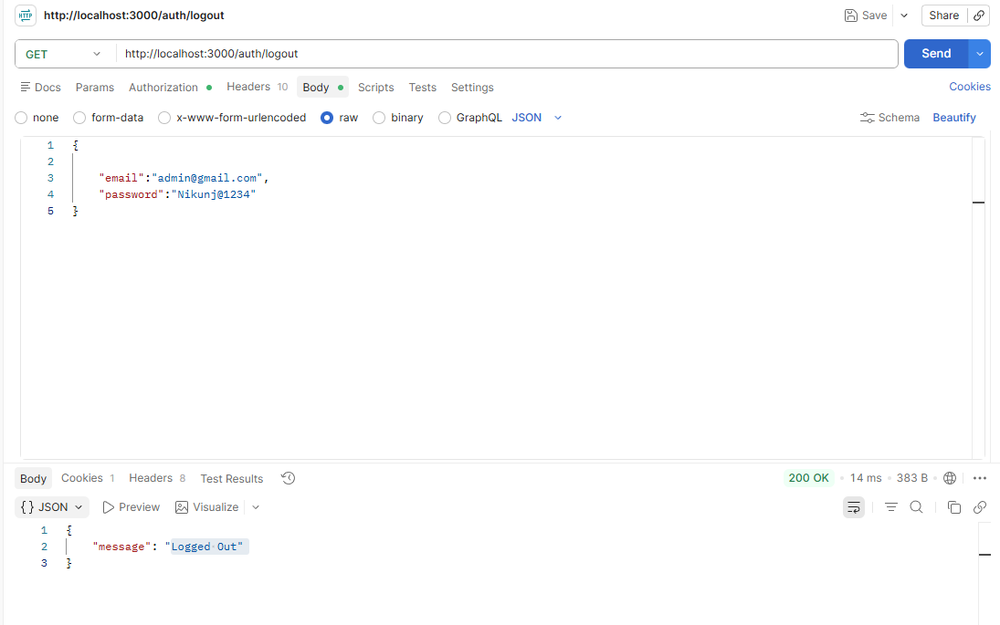

# Passport Js
- it Used for Authentication of User and Creating Session Using Express.js

## Packages Required
```
npm install passport
npm install passport-local
npm install express-session
npm install bcrypt
```
## What is bcrypt?
- it will convert you password to hash.
- it will save your data(password) to protect from Rainbow Attacks

## Project Structure
```
project/
│
├── server.js
│
├── config/
│   └── passport.js
│
└── routes/
    └── authRoutes.js
```

- config/passport.js
```
import passport from 'passport';
import {Strategy as LocalStrategy } from 'passport-local';
import bcrypt from 'bcrypt';

// fake user Database
const users=[
    {
        id:1,
        email:'admin@gmail.com',
        password:await bcrypt.hash('Nikunj@1234',10) // here 10 is cost factor(also known as 'salt')
    }
];

passport.use(
    new LocalStrategy(
        {
            usernameField:'email'
        },
        async (email,password,done)=>{
            const user= users.find(u=>u.email === email);
            if(!user){
                return done(null,false,{message:'User Not Found'});
            }
            const match= await bcrypt.compare(password,user.password)
            if(!match){
                return done(null,false,{message:'Wrong Password'});
            }
            return done(null,user);
        }
    )
);

// lets store session ID in session
/* Example:
{
    id:1,
    email:'admin@gmail.com'
}
    So Passport stores: 1
*/
passport.serializeUser(
    (user,done)=>{
        done(null,user.id);
    }
)

/* Passport receives 1
and converts it back to
{
    id:1,
    email:'admin@gmail.com'
}
 */

// retrive User from Session
passport.deserializeUser( 
    (id,done)=>{
        const user= users.find(u=> u.id === id);
        done(null,user);
    }
)

export default passport
```

- routes/authRoutes.js
```
import express, { json } from 'express';
import passport from 'passport';

const authrouter = express.Router();

//login
authrouter.post('/login', passport.authenticate('local'), (req, res) => {
    res.json({
        success: true,
        user: req.user
    })
})

// dashboard
authrouter.post('/dashboard', (req, res) => {
    if (!req.isAuthenticated()) {
        return res.status(401).json({
            message:'Please Login'
        });
    }
    res.json({
        message:'Welcome to Dashboard',
        user: req.user
    })

})

//Logout
authrouter.get('/logout',(req, res) => {
     req.logout(err=>{
        if(err) return res.status(500).json(err);
        res.json({
            message:'Logged Out'
        })
     })

})

export default authrouter
```

- server.js
```
import express from 'express';
import connectDB from "./config/db.js";
import useRoutes from "./routes/userRoutes.js";
import authrouter from './routes/authRoutes.js';

import session from 'express-session';
import passport from './config/passport.js';

const app = express();

app.use(express.json());

connectDB();

// Session Middleware FIRST
app.use(
    session({
        secret: 'mysecretkey',
        resave: false,
        saveUninitialized: false
    })
);

// Passport Middleware
app.use(passport.initialize());
app.use(passport.session());

// Routes
app.use("/users", useRoutes);
app.use("/auth", authrouter);

app.listen(3000, () =>
    console.log(
        'Server is Running and up! \nvisit: http://localhost:3000'
    )
);
```

## Testing Using Postmen
Step:1 Do The Login USing Coorect Credential
- url: http://localhost:3000/auth/login


Step:2 Move to Dashboard


Step:3 Do the Logout


Step:4 Try to Access Dashboard Withoout Login
 

Step:5 Do The Login Using Wrong Credentials

- All Set Your API is Integrated with Passport.js