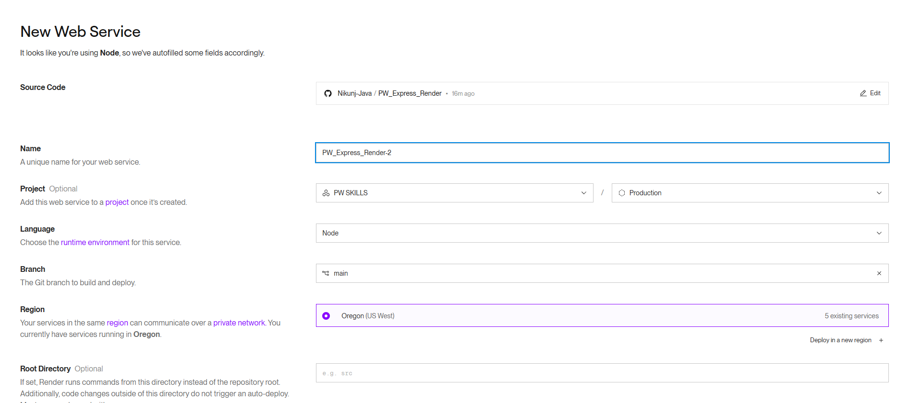
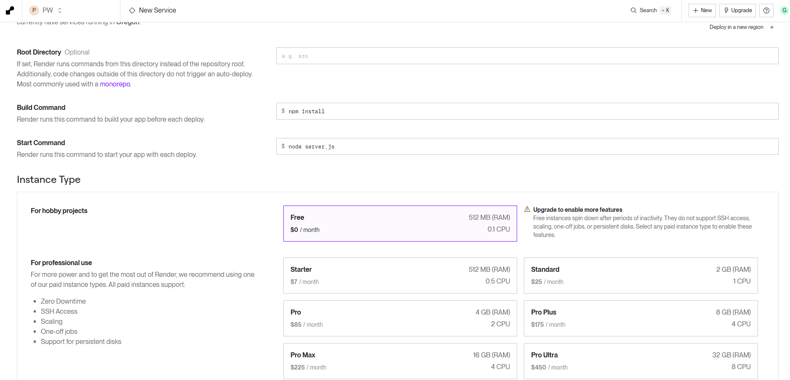
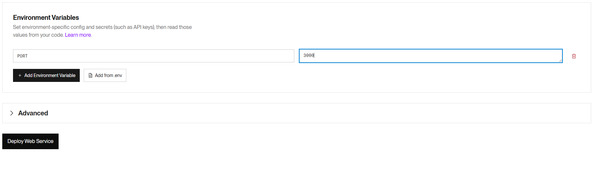
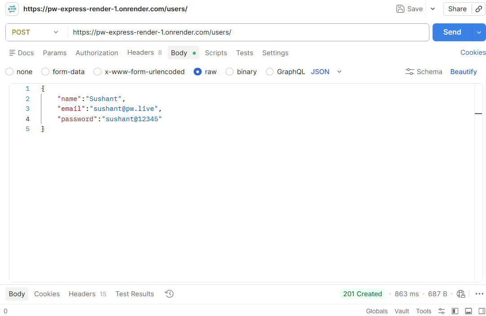

# Express.js Deployment 
# Express.js + Passport.js Authentication REST API Project Task

## Objective

Develop a production-ready **Express.js Authentication REST API** using
**Passport.js**, **MongoDB Atlas**, **Express Routing**, and **CORS**,
then deploy it as a **Netlify Serverless Function**.

## Learning Outcomes

-   Create an Express.js application
-   Configure Express Routing
-   Build REST APIs
-   Integrate MongoDB Atlas using Mongoose
-   Configure CORS
-   Implement Passport.js Local Authentication
-   Hash passwords using bcrypt
-   Manage sessions
-   Protect routes using middleware
-   Deploy on Netlify

## Technologies

-   Node.js
-   Express.js
-   Passport.js
-   passport-local
-   express-session
-   bcrypt
-   cors
-   dotenv
-   MongoDB Atlas
-   Mongoose
-   Netlify Functions

## Functional Requirements

### Authentication

-   User Registration
-   User Login
-   User Logout
-   Protected Profile

### Routes

#### Home

  Method   Route
  -------- ----------
  GET      /
  GET      /about
  GET      /contact

#### Authentication

  Method   Route
  -------- --------------------
  POST     /api/auth/register
  POST     /api/auth/login
  POST     /api/auth/logout
  GET      /api/auth/profile

#### Users

  Method   Route
  -------- ----------------
  GET      /api/users
  GET      /api/users/:id
  PUT      /api/users/:id
  DELETE   /api/users/:id

## CORS Requirements

-   Install and configure `cors`
-   Allow only trusted frontend origins
-   Enable GET, POST, PUT, DELETE methods
-   Enable credentials for Passport sessions
-   Reject unauthorized origins

## Middleware Order

1.  express.json()
2.  express.urlencoded()
3.  cors()
4.  express-session
5.  passport.initialize()
6.  passport.session()
7.  Routes
8.  Global Error Handler

## Suggested Structure

``` text
express-auth/
├── functions/
│   └── api.js
├── config/
│   ├── database.js
│   └── passport.js
├── controllers/
├── middleware/
├── models/
├── routes/
│   ├── homeRoutes.js
│   ├── authRoutes.js
│   └── userRoutes.js
├── .env
├── package.json
├── netlify.toml
└── README.md
```

## MongoDB Atlas

-   Create a free cluster
-   Database: `express_auth`
-   Collection: `users`
-   Store URI in `.env`

## Dependencies

``` bash
npm install express mongoose passport passport-local express-session bcrypt cors dotenv
npm install --save-dev nodemon
```

## Validation & Security

-   Email validation
-   Password length validation
-   Prevent duplicate users
-   Hash passwords with bcrypt
-   Store secrets in `.env`
-   Protect profile route

## Deployment

Deploy the API on Netlify/Renderer as a serverless function and verify
registration, login, logout, protected routes, and CORS from a frontend.

## Step: 1 Open Renderer
- Open Rendere and Create/Login to Your Account
```
https://www.render.com/
```
## Step: 2 Web Service
```
click on + icon (Right Side Corner)> Web Service
```
## Step: 3 Add the Below Details
- Connect & choose GitHub Project 






- click on Deploy

- on Successfull Deployment You will Get the URL

- Replace That URL in POSTMEN and Check the API


 

 

 