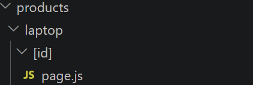
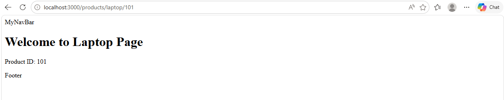
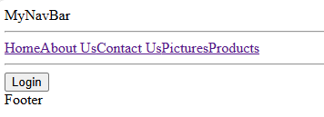
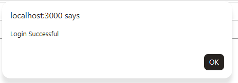
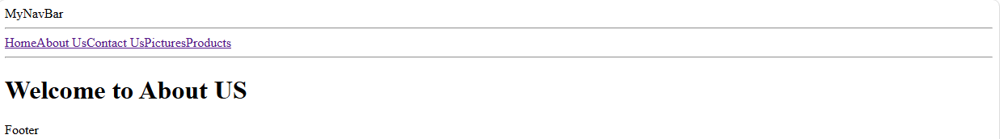
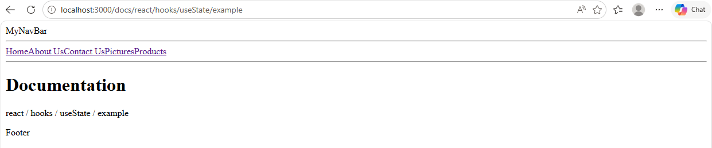

# Next Js Setup
- Create Your First Next js Application
```
npx create-next-app@latest my-first-next-app
```
- Customise the Application

- Choose the below Settings


- Open the Next.js App
```
http://localhost:3000/
``` 


## Routing in Next.js
- Routing in Next.js is One of the simplest Routing Ever
- Just Create a Folder under app
```
app/
    about/
        page.js
    home/
        page.js
    contact/
        page.js
        
```


## Nexted Routing
- For Nested Routing we can use the same structure
```
app/
    products/
        tv/
            page.js
        mobile/
            page.js
        soundbar/
            page.js
        laptop/
            page.js
        
```
- about/page.js
```
export default function About(){
    return(
        <h1>Welcome to About US</h1>
    )
}
```
- similarly you can create pages for all routing

## Loading in Next .js
- just implement loading.js under app/
- now whenever it requres Automatically shown while data loads.
- loading.js
```
export default function Loading() {
  return <h2>Loading...</h2>;
}
```
## Error Handling
- error.js
```
"use client";

export default function Error() {
  return (
    <h2>Something went wrong.</h2>
  );
}
```

## Page Not Found
- not-found.js
```
export default function NotFound() {
  return (
    <h1>404 Page Not Found</h1>
  );
}
```
- Now when path is not avaialable it will be called
```
http://localhost:3000/products/mobile/1
```

# Dynamic Routing
- Suppose you have paths like this
```
/products/101
/products/102
/products/103
/products/104
```
- All of these URLs use the same file.
- so we have to create a structure like:
```
app
│
├── products
│     ├── 1
│     │     page.js
│     ├── 2
│     │     page.js
│     ├── 3
│     │     page.js
│     ├── 4
│     │     page.js
│     └── ...
```
- Which is Impossible
- Then What is the Solution
- with dynamic Routing we can make it easy
```
app
│
└── products
    └── Laptop
          └── [id]
                └── page.js
```

- page.js
```
export default async function LaptopPage({ params }) {

  const { id } = await params;

  return (
    <div>
      <h1>Welcome to Laptop Page</h1>
      <p>Product ID: {id}</p>
    </div>
  );
}
```
- open browser and check
```
http://localhost:3000/products/laptop/101
http://localhost:3000/products/laptop/1
http://localhost:3000/products/laptop/ABC
http://localhost:3000/products/laptop/abc
```

- here: 101,1,ABC,abc all are Ids



## Server Vs Client in Next.js 
- by default all pages are server pages in next.js
- but the page which needs interaction considered to be client page
- to make the server page as client page add below syntax
```
"use client"
```
- app/products/[id]/page.js
```
"use client"; // this will make the page as client

import { useState } from "react";

export default function AddToCart({ productId }) {

  const [added, setAdded] = useState(false);

  function handleClick() {
    console.log("Product Added:", productId);
    setAdded(true);
  }

  return (
    <div>
      <button onClick={handleClick}>
        {added ? "Added ✓" : "Add to Cart"}
      </button>
    </div>
  );
}
```

## Link in Next.js
- Why use 'link' instead of 'a'?
- Because 
  - Link will load only the change required in a webpage
  - where as "anchor tag: a" will load entire page 
- import link
```
import Link from "next/link";
```
- layout.js
```
<nav>
          MyNavBar
          <br></br>
          <hr></hr>
            <Link href="/">Home</Link>
            <Link href="/about">About Us</Link>
            <Link href="/contact">Contact Us</Link>
            <Link href="/gallery">Pictures</Link>
            <Link href="/products/101">Products</Link>
          <hr></hr>
        </nav>
```
------------------------------------------------------------------------
## Programmatic Navigation (useRouter)
- sometimes you don't want user to click on a link
- example
  - on successful Login--> Go to Dashboard
  - on successful Logout--> Go to Login
  - Payment Completed --> Go to Success Page
- so here we will use 'useRouter'
- Create a folder under app named: login
- app/login/page.js
```
"use client"
//as it need interaction we will use as a client

import { useRouter } from "next/navigation";

export default function Login(){
    const router=useRouter();

    function handleLogin(){
        alert("Login Successful");
        router.push("/about")
    }
    return(
        <div>
            <button onClick={handleLogin}>Login</button>
        </div>
    )
}
```





-------------------------------------------------------------------------
## Catch All Routes
- sometimes we don't know that how many URL segment will have
- Example
```
/docs/react
/docs/react/hooks
/docs/react/hooks/useState
/docs/react/hooks/useState/example
```
- Creating Folder mannually is impossible.
- instead we use:
```
app
|
|--docs
    |
    |---[...slug]
          |
          |--page.js
```
- Note: [...slug] means Accept every segment after /docs.

- Create app/docs/[...slug]/page.js



## Redirect
- it is also use for navigation (redirecting the route)
```
import { redirect } from "next/navigation";
```
- how to use
```
redirect("/login")
```
- app/dashboard
```
import { redirect } from "next/navigation";

export default function Dashboard(){
    const loggedIn= false;// make false and check the output
    
    if(!loggedIn){
        redirect("/login");
    }
    return <h1>Dashboard</h1>
}
```
- now visit:
```
http://localhost:3000/dashboard
```
- it will redirects you to login page
- change:
```
const loggedIn= true;

```
- it will not redirects and you will be on Dahsboard Page Only