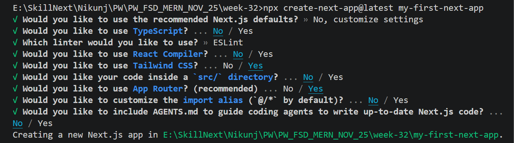
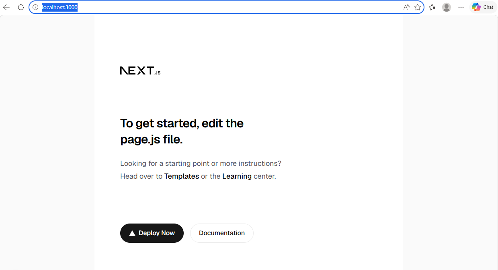
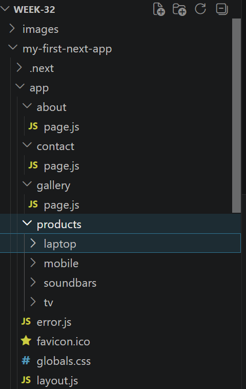

# Next Js Setup
- Create Your First Next js Application
```
npx create-next-app@latest my-first-next-app
```
- Customise the Application

- Choose the below Settings


- Open the Next.js App
```
http://localhost:3000/
``` 


## Routing in Next.js
- Routing in Next.js is One of the simplest Routing Ever
- Just Create a Folder under app
```
app/
    about/
        page.js
    home/
        page.js
    contact/
        page.js
        
```


## Nexted Routing
- For Nested Routing we can use the same structure
```
app/
    products/
        tv/
            page.js
        mobile/
            page.js
        soundbar/
            page.js
        laptop/
            page.js
        
```
- about/page.js
```
export default function About(){
    return(
        <h1>Welcome to About US</h1>
    )
}
```
- similarly you can create pages for all routing

## Loading in Next .js
- just implement loading.js under app/
- now whenever it requres Automatically shown while data loads.
- loading.js
```
export default function Loading() {
  return <h2>Loading...</h2>;
}
```
## Error Handling
- error.js
```
"use client";

export default function Error() {
  return (
    <h2>Something went wrong.</h2>
  );
}
```

## Page Not Found
- not-found.js
```
export default function NotFound() {
  return (
    <h1>404 Page Not Found</h1>
  );
}
```
- Now when path is not avaialable it will be called
```
http://localhost:3000/products/mobile/1
```