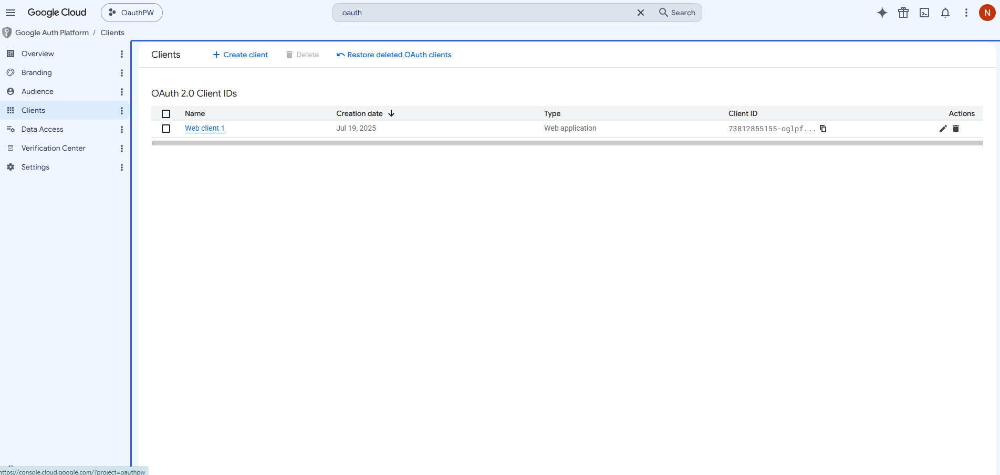
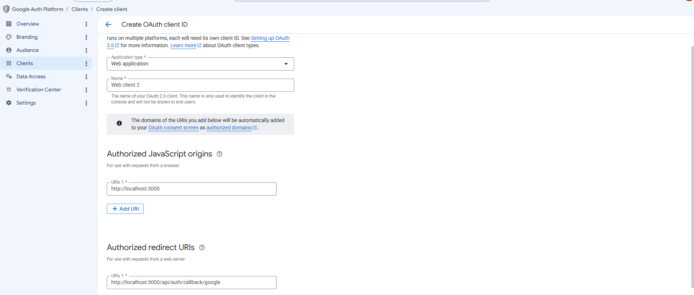
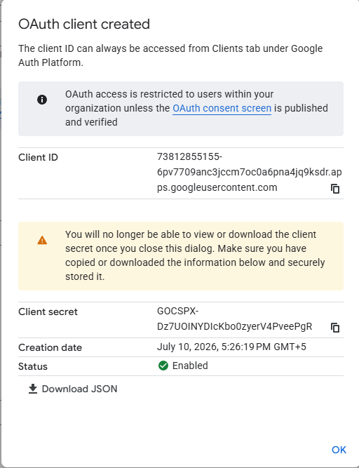

# Google Authentication In Next Js
## Create Google OAuth Credentials
[Google Console](https://console.cloud.google.com/welcome?pli=1&project=oauthpw)
1. Create a project.


    - Click on Client
2. Enable the Google Identity / OAuth APIs.
3. Create an OAuth Client ID.
4. Configure:
```
    Authorized JavaScript origins (e.g., http://localhost:3000)
    Authorized redirect URI (e.g., http://localhost:3000/api/auth/callback/google)
```


5. Copy:
```
    Client ID
    Client Secret
```


## Create .env.localfile
```
GOOGLE_CLIENT_ID=your_google_client_id

GOOGLE_CLIENT_SECRET=your_google_client_secret

NEXTAUTH_SECRET=some_random_secret

NEXTAUTH_URL=http://localhost:3000

```

## Install Next Auth
```
npm install next-auth
```

## Configure Auth.js
- Create 
```
app/api/auth/[...nextauth]/route.js
```
- route.js
```
import NextAuth from "next-auth";
import GoogleProvider from "next-auth/providers/google";

const handler = NextAuth({
  providers: [
    GoogleProvider({
      clientId: process.env.GOOGLE_CLIENT_ID,
      clientSecret: process.env.GOOGLE_CLIENT_SECRET,
    }),
  ],
});

export { handler as GET, handler as POST };
```
- This route handles all authentication requests.

## Create Login Button
```
components/LoginButton.jsx
```
```
"use clinet";

import { signIn } from "next-auth/react";

export default function LoginButton(){
    return(
        <button onClick={() => signIn("google")}>Sign In With Google</button>
    )
}
```

## Create Sign Out Button
```
components/LogoutButton.jsx
```
```
"use client";

import { signOut } from "next-auth/react";

export default function LogoutButton() {
  return (
    <button onClick={() => signOut()}>
      Logout
    </button>
  );
}
```
## Display Login Button
```
import Image from "next/image";
import LoginButton from "./components/LoginButton";

export default function Home() {
  return (
    <div className="flex flex-col flex-1 items-center justify-center bg-zinc-50 font-sans dark:bg-black">
      <main className="flex flex-1 w-full max-w-3xl flex-col items-center justify-between py-32 px-16 bg-white dark:bg-black sm:items-start">
         <h1>Google authentication Demo</h1>
         <LoginButton/>
      </main>
    </div>
  );
}
```
## Protect a Page
```
app/dashboard/page.js
```
```
import { getServerSession } from "next-auth";
import { redirect } from "next/navigation";


export default async function DashboardPage() {
    const session= await getServerSession(authOptions);
    if (!session) {
        redirect("/");
    }
    return(
        <div className="flex flex-col flex-1 items-center justify-center bg-zinc-50 font-sans dark:bg-black">
              <main className="flex flex-1 w-full max-w-3xl flex-col items-center justify-between py-32 px-16 bg-white dark:bg-black sm:items-start">
                  <h1> Dashboard </h1>
                  <p> Welcome, {session.user.name}!</p>
                  <p> {session.user.email}!</p>
              </main>
            </div>
    )

}
```
