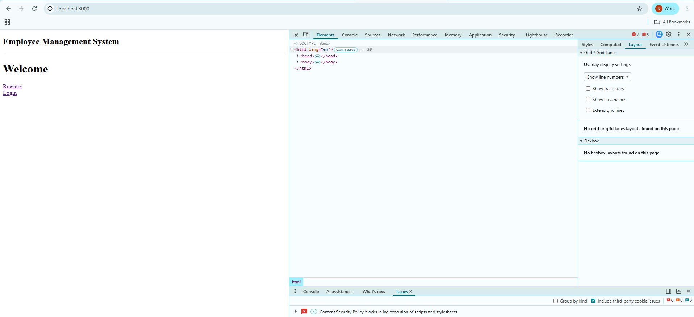
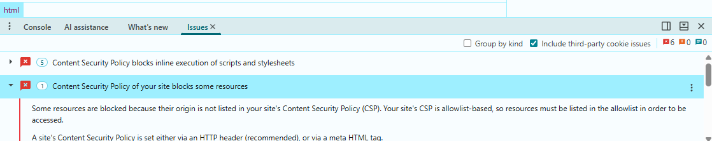

# CSP Configuration
- next.config.mjs
```
/** @type {import('next').NextConfig} */
const nextConfig = {
  /* config options here */
  async headers(){
    return [
      {
        source:"/(.*)",
        headers:[
          {
            key:"Content-Security-policy",
            value:
            "default-src 'self';"+
            "script-src 'self';"+
            "style-src 'self' 'unsafe-inline';"+
            "img-src 'self' data: https:; "+
            "font-src 'self'; " +
            "object-src 'none';"
          }
        ]
      }
    ]
  }
};

export default nextConfig;

```
- Restart the server
```
npm run dev
```
- now every request return below header
```
Content-Security-Policy
```
## Check Browser

- Now Lets check the inline Script Blocking
- add the below code in page.js
```
<script src="https://evil.com/virus.js"></script>
```
- Browser
```
CSP

↓

Not Allowed

↓

Blocked
```
