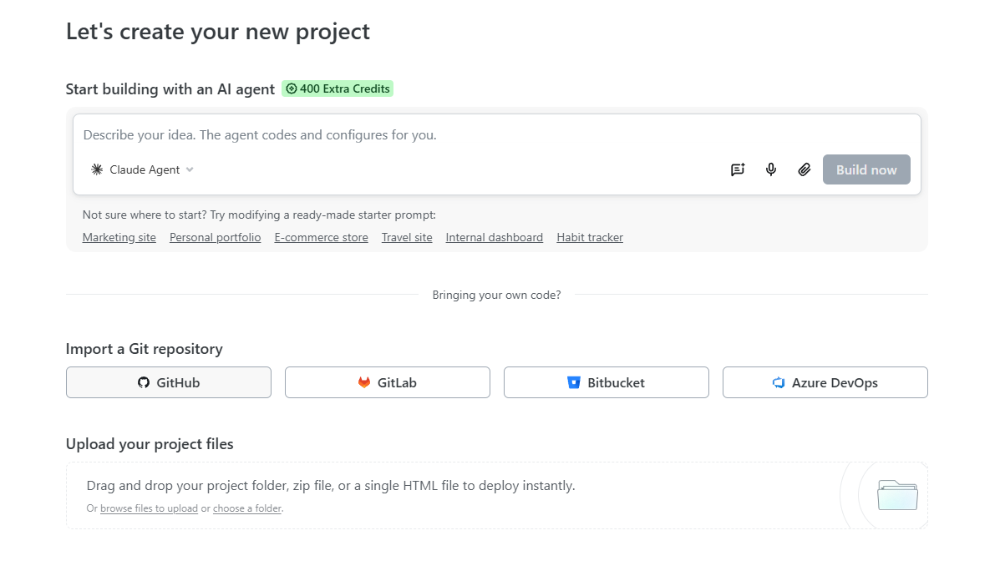
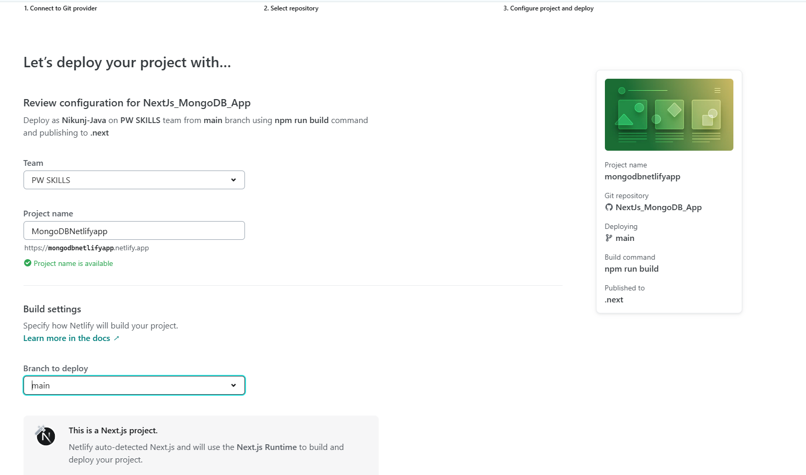
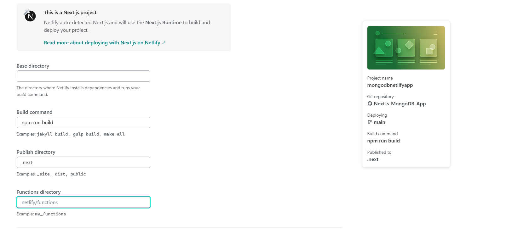
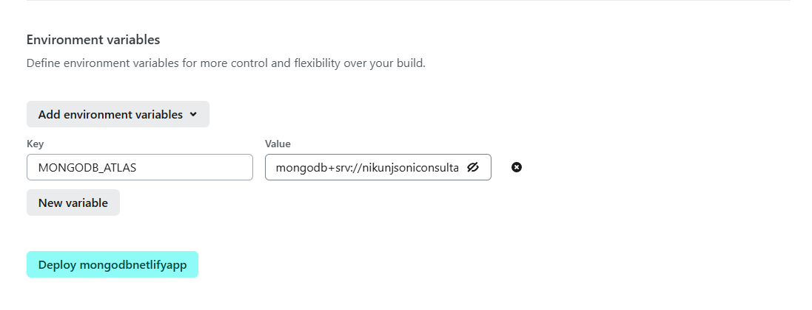
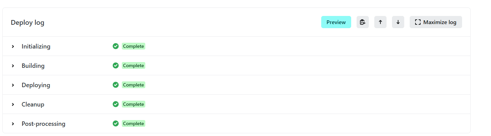
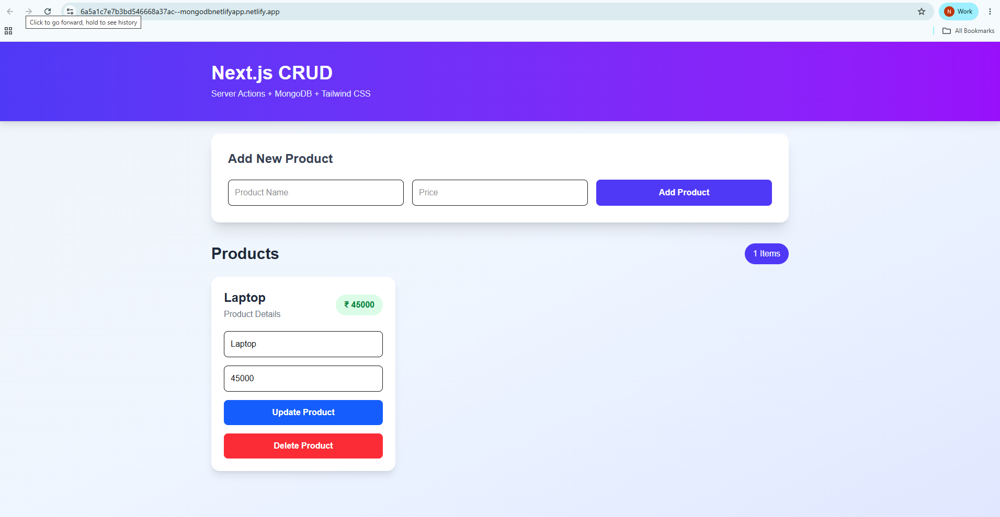
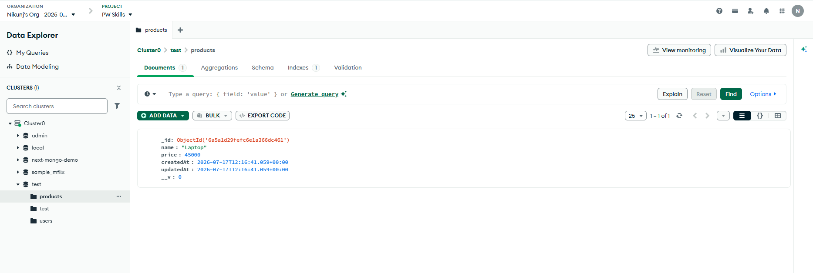

# Deploy Your Nextjs Application on Netlify
[text](https://app.netlify.com/)


## Step:1 Create a Build of Your Application
```
npm run build
```

## Step:2 Upload your code on GitHub Repo
[Next js MongoDb Application](https://github.com/Nikunj-Java/NextJs_MongoDB_App.git)
## Step:3 Sign In
- sign in using Github
- Google
- Email

## Step:4 Import Existing Project

- choose GitHub
- choose your project

- if your project is not in the list configure Netlify with Github by clicking the Below Givenm Link on the page
- Allow only one repository which you want to deploy











- check Your Data in MongoDB Atlas

