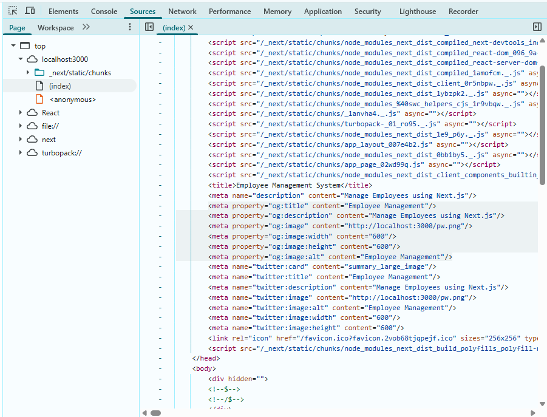
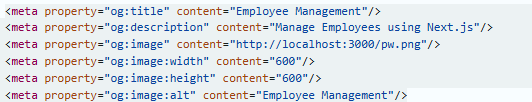

# SEO in Next.js (Step-by-Step)

## Learning Objectives

-   Understand SEO in Next.js
-   Metadata API
-   Dynamic Metadata
-   Open Graph Images

## Why SEO?

SEO improves search engine visibility.

## Metadata Example

``` js
export const metadata={title:'Employee Management',description:'Manage employees'}
```

## Dynamic Metadata

``` js
export async function generateMetadata({params}){
 return {title:`Product ${params.id}`}
}
```

## OG Metadata
- it is called Open Graph Metadata
- it is used to load preview of your webpage while sharing accross other platforms
```
export const metadata = {
  title: "Employee Management System",
  description: "Manage Employees using Next.js",
  openGraph: {
    title: "Employee Management",
    Description: "Manage Employee",
    images: [{
      url: "/pw.png",
      width: 600,
      height: 600,
      alt: "Employee Management"
    },
    ],
  },
};
```
- run the application
```
npm run dev
```
- open the browser>inspect>sources>index.html

;

- you should see tags like this
```
<meta property="og:title" content="Employee Management">
<meta property="og:description" content="Manage Employee">
<meta property="og:image" content="http://localhost:3000/pw.png">
```